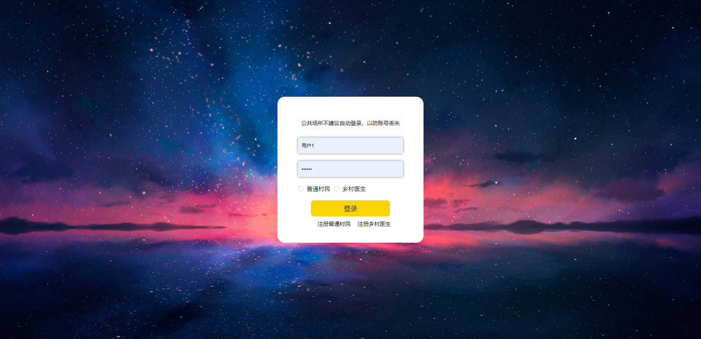
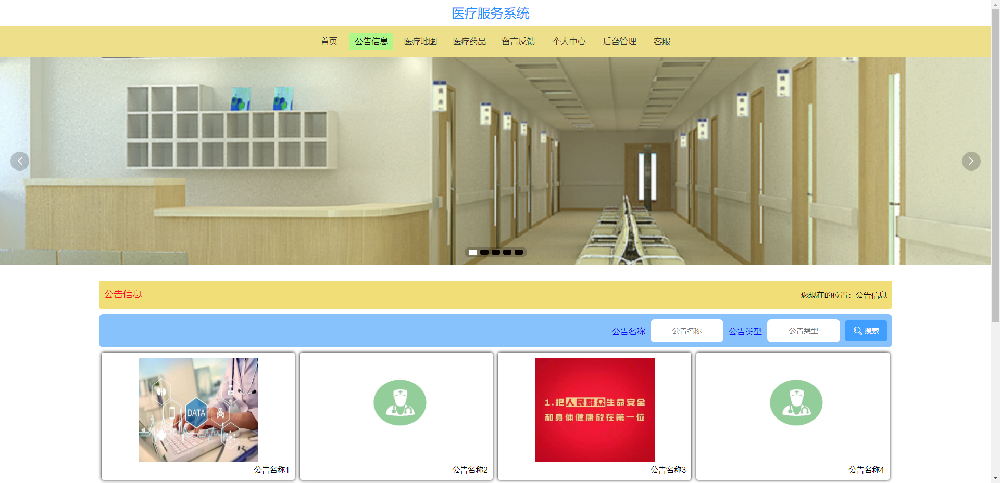
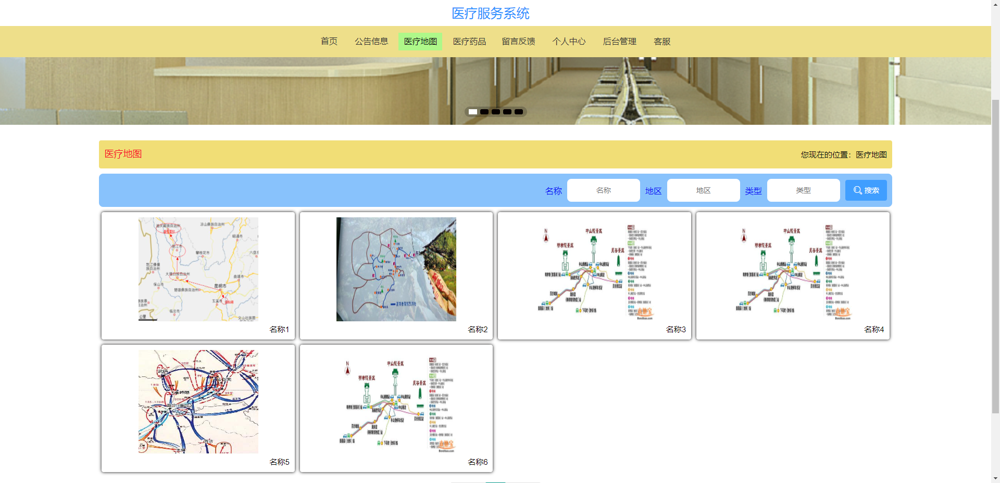
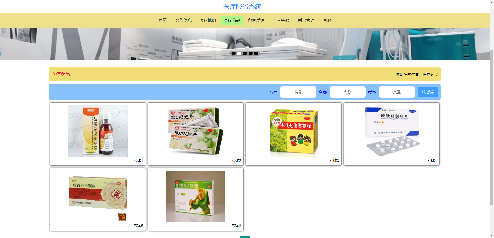
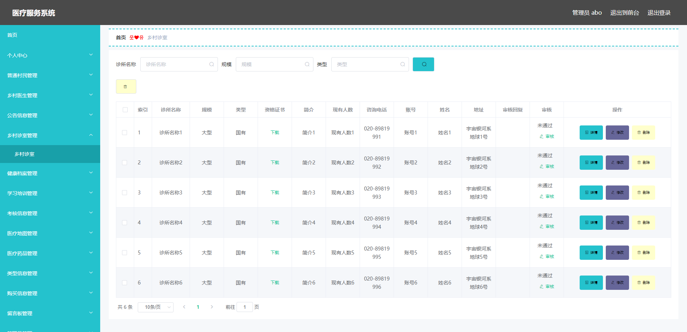
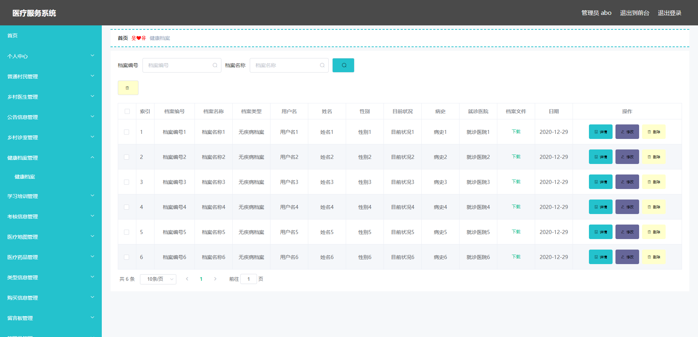
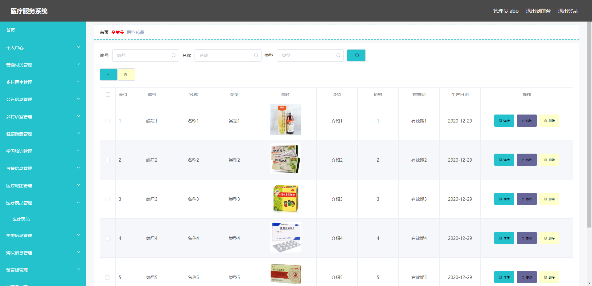
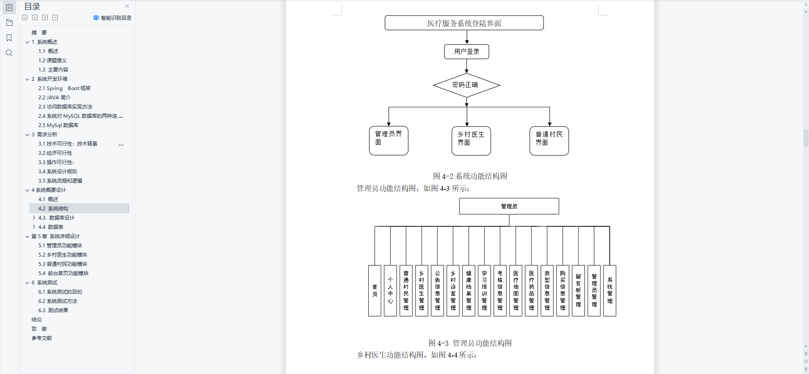
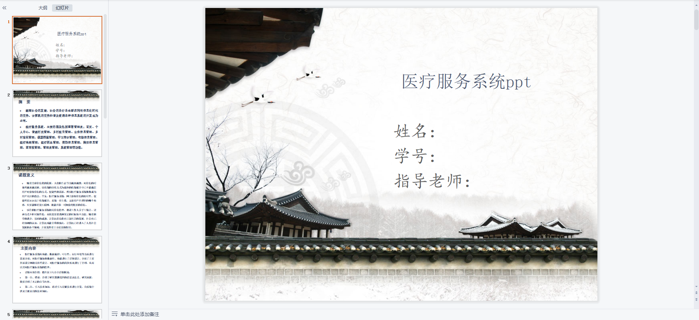
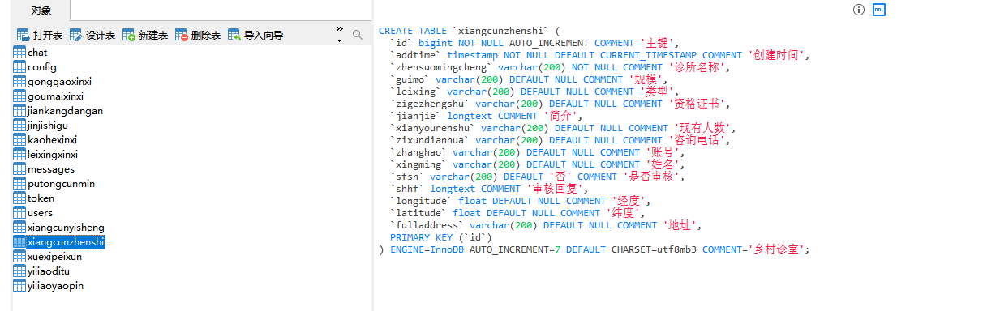

# 1 项目介绍
基于SSM+Vue的医疗服务平台：后端 SpringBoot、Mybatis-Plus，前端Vue+ElementUI，具体功能如下：
## 管理员
- 个人中心：查看和修改个人信息、修改密码
- 普通村民管理
- 乡村医生管理
- 公告信息管理
- 乡村诊室管理
- 健康档案管理
- 学习培训管理
- 医疗地图管理
- 医疗药品管理
- 购买信息管理
- 留言板管理

二、乡村医生
- 首页
- 个人中心
- 公告信息管理
- 乡村诊室管理
- 健康档案管理
- 紧急事故管理
- 学习培训管理
- 购买信息管理
三、普通村民
- 首页
- 个人中心
- 健康档案管理
- 紧急事故管理
- 留言板管理
# 2 系统运行截图
## 2.1 用户登录

## 2.2 公告信息

## 2.3 医疗地图

## 2.4 医疗药品

## 2.5 乡村诊室管理

## 2.6 健康档案管理

## 2.7 医疗药品管理

## 2.8 万字文档

## 2.9 ppt

# 3 数据库设计

# 4 源码数据库获取(收费)

